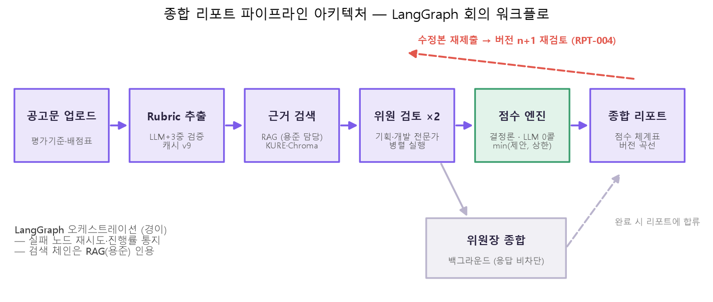
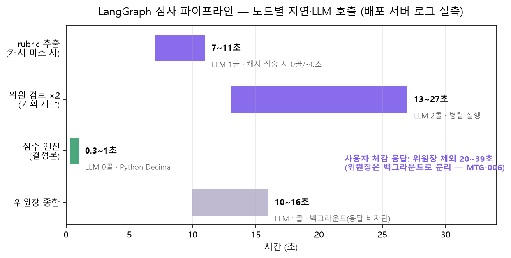
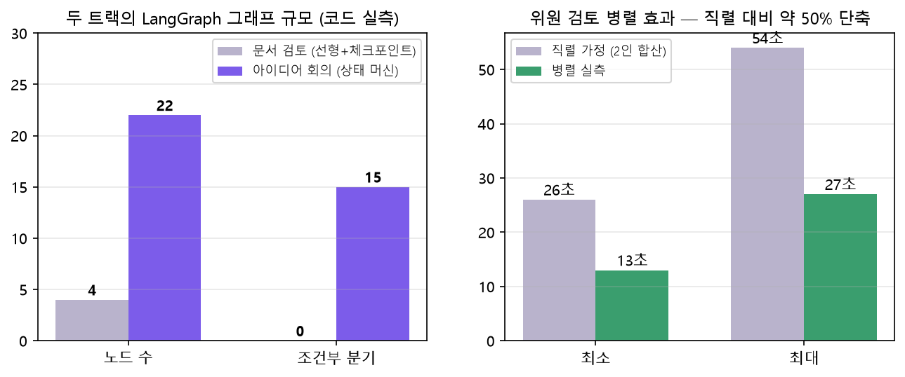

# LangGraph 통합 평가 리포트 — 아이디어 회의 · 문서 검토 두 트랙 (경이 담당 파트)

> 작성: 경이(민경이) / 2026-07-30
> 담당 범위(요구사항정의서 기준): **LangGraph 오케스트레이션 · 점수 엔진 · 평가 결과 구조**

---

## 0. 표기 원칙 — 가이드의 "LangChain 오케스트레이션" 요구와 본 파트의 관계

강의 가이드는 오케스트레이션 도구로 LangChain(LCEL·Retrieval Chain)을 권장한다.
본 프로젝트에서 이 요구는 두 담당이 나누어 충족한다:

- **검색·생성 체인(LangChain)** — RAG 레이어, **용준 담당**. 본 리포트에서는 실측값을
  출처와 함께 **인용**만 한다.
- **회의·채점 워크플로(LangGraph)** — **경이 담당(본 리포트의 범위)**. LangGraph는
  LangChain 팀이 만든 **그래프 기반 오케스트레이션 확장**(langchain-core 위에서 동작)으로,
  가이드 평가 항목 "체인 설계, 검색·생성 흐름의 완성도"에서 **흐름의 완성도**
  (상태 머신·병렬·재시도·결정론 구간)를 담당한다.

즉 어느 쪽도 상대의 산출물을 자기 것으로 표기하지 않으며, 이 원칙은 문서 전체에 적용된다.

---

## 평가 대상 요약 (시스템 · 모델 · 데이터셋 · 테스트셋)

| 구분 | 내용 |
|---|---|
| 시스템 | AI Review Board — 아이디어 회의(트랙 A) · 문서 검토/종합 리포트(트랙 B) |
| 오케스트레이션 | LangGraph (트랙 A: 22노드 상태 머신 / 트랙 B: 4노드 병렬 파이프라인) + 결정론 점수 엔진(Python Decimal) |
| 모델 | OpenAI gpt-4o-mini (위원 채점·rubric 추출), temperature=0 |
| 검색 | KURE-v1 임베딩 + Chroma, 역할 기반 재랭킹 (RAG 레이어 — 용준 담당, 실측 인용) |
| 데이터셋(코퍼스) | 「2026년 공공기관 AI 혁신 챌린지」 공고문 — rubric 추출 원천 + 근거 검색 코퍼스 (채점 4항목 85점 + 제외 2항목 15점) |
| 테스트셋(골든셋) | 동일 과제 수행보고서 품질 단계별 4버전 — 의도 품질 순위가 정답 라벨 (특성 실측: 3.1절) |

**핵심 설계 3원칙** (신뢰성의 뼈대 — 상세 실측은 각 절):

1. **"LLM은 의견, 코드가 확정"** — 문서 원문을 결정론 규칙(출처 실명·정량·실행 실체·분량)으로
   검사해 항목별 상한을 계산하고, 최종 점수 = min(위원 제안, 상한). 같은 문서면 언제나 같은 상한 (3.2절).
2. **Rubric 자동 추출 + 측정성 스코핑** — 공고문 배점표를 LLM으로 추출하되 3중 검증(배점 서버
   재계산 · perspective 화이트리스트 · 위원 배정 강제)으로 기준 지어내기를 차단하고, 측정 불가
   항목(가치 판단·가점)은 **사유와 함께 점수에서 제외** (100점 중 채점 85 / 제외 15).
3. **근거 기반성** — 위원 지적은 원문 문장 1:1 인용 검증, 항목별 근거가 부족하면 숫자 점수
   자체를 차단(근거 게이트). 버전 추적의 "해결됨"도 새 버전 원문에서 재검증 (3.4절).

---

## 1부 — 공통 인프라 지표 (두 트랙 공유)

### 1.1 LangGraph 오케스트레이션 지표 (심사 파이프라인 — 배포 서버 로그 실측)

| 그래프 노드·단계 | 역할 | LLM 호출 | 실행 방식 | 실패 대응 | 평균 시간(실측) |
|---|---|---|---|---|---|
| rubric 추출 | 공고문 → 채점 기준 | 1콜 (캐시 적중 시 **0콜**) | 분석 초입 1회 | 검증 실패 시 정적 템플릿 폴백 | 7~11초 (캐시 시 ~0초) |
| 위원 검토 ×2 | 기획·개발 전문가 독립 채점 | 2콜 | **병렬** | 실패 노드만 재실행 (체크포인트) | 13~27초 |
| 점수 엔진 | 상한·가중합·판정 확정 | **0콜** (결정론) | 동기 | 해당 없음 (동일 입력=동일 출력) | <1초 |
| 위원장 종합 | 쟁점·액션 정리 | 1콜 | **백그라운드** (응답 비차단) | 체크포인트 재개 | 10~16초 |

- **병렬 효과**: 위원 2인을 병렬 실행해 직렬 가정(26~54초) 대비 **약 50% 단축**(13~27초 실측).
- **실패 복구**: 위원장 노드가 실패해도 같은 thread_id로 재개하면 성공한 위원 노드는
  재실행되지 않음 — `test_meeting_graph_resumes_from_failed_chair_without_rerunning_reviewers` 검증.
- **LLM 0콜 구간**: 점수 확정이 결정론(Python Decimal)이라는 것 자체가 오케스트레이션
  설계 지표 — "LLM은 의견, 코드가 확정".
- **진행률 정직성**: reviews_done 단조 증가·단계 문자열 통지 —
  `test_run_meeting_reports_progress_until_completed` 검증.

### 1.2 검색 품질 — RAG 레이어(용준) 실측 인용

Recall@5 0.944 → **1.000**(타입 라우팅 적용 후), MRR@5 1.000, 검색 실패율 0,
평균 289ms — 36케이스 오프라인 평가셋, 검수 전 참고치
(`reports/rag_eval_current_v6_36_*`, 2026-07-28).

### 1.3 재현성 (공통 결정론 층)

temperature=0 + 결정론 점수 엔진. 동일 LLM 출력(stub) 반복 실행 시 총점·판정 편차 **0**
(`test_consistency.py`, n=3). 부실 문서 총점 29.5는 상한 합과 정확히 일치하며 LLM 없이
로컬 재현됨 (트랙 B 리포트 4.2절).

### 1.4 TST-002 위원 일관성 — 동일 문서 반복 평가 실측

배포 서버에서 **동일 채점 코드·동일 문서를 독립적으로 반복 분석**한 실측
(2026-07-28~29, 2인 위원 체제). 허용범위는 사전 정의값(총점 range ≤ 10,
항목 ≤ 8, judgment 일치 ≥ 0.6 — `ConsistencyTolerance`)을 적용한다.

| 문서 | 반복 | 총점 실측 | 편차(range) | 허용(≤10) |
|---|---|---|---|---|
| v1.0 (부실) | 3회 | 29.5 / 29.5 / 29.5 | **0** | ✅ |
| v1.1 | 3회 | 64 / 62 / 65 | **3** | ✅ |
| v1.2 | 3회 | 65 / 64 / 65 | **1** | ✅ |
| v1.3(구) | 2회 | 65 / 65 | **0** | ✅ |

**해석**: 파이프라인 자체 편차는 0(stub 검증)이므로 관측 편차의 전부가 LLM 제안 층인데,
그 총점 편차도 최대 3점 — **허용범위(10)의 30% 수준**. 결정론 상한이 지배하는 부실
문서(v1.0)는 완전 무편차로, "하한은 결정론이 잠근다"는 설계가 반복 실행에서도 성립한다.
항목 단위 편차·핵심 지적 일치율(Jaccard)의 세부 실측은 동일 하네스
(`run_consistency_check`)의 실LLM 확장으로 이어갈 계획이다.

---

## 2부 — 트랙 A: 아이디어 회의하기 (경이 담당 관점 — 그래프 오케스트레이션·평가 구조)

아이디어 회의는 22개 노드·**15개 조건부 분기**의 LangGraph 상태 머신이다(코드 실측 —
문제 발굴 → 초점 선택 → 아이디어 발산 → 충돌·병합 → 잠정 선택 → 기획/기술 검증 →
콘셉트 확정, 사용자 개입 노드 분리). 본 담당 범위의 지표는 **콘텐츠 품질이 아니라
오케스트레이션·구조의 신뢰성**이다 (발언 내용 품질·검색 품질은 각각 프롬프트·RAG 담당
영역이라 아래 2.3처럼 계획·인용으로 다룬다).

### 2.1 오케스트레이션 구조 지표 (테스트로 검증)

| 지표 | 정의 | 검증 방법·상태 |
|---|---|---|
| 상태 전이 안전성 | 진행자(facilitator)가 전문가 검증 노드가 결정한 phase를 임의로 뒤집지 않음 | 회귀 테스트 존재 |
| 검증 게이트 | 빈 judgment로 빈 카드가 생성되는 것을 거부 | 회귀 테스트 존재 |
| 중단 정규화 | 라운드 전환 중 취소돼도 phase가 일관 상태로 정규화 | 회귀 테스트 존재 |
| 사용자 개입 분기 | 기획/개발 질문 노드가 END로 분리 — 사용자 답변 없이 회의가 폭주하지 않음 | 그래프 구조 (질문 노드 → END) |
| 출력 계약 준수 | 최종 산출이 `contracts/schemas/ideation_output.schema.json` 검증 통과 | jsonschema 검증 |
| 동적 라운드 진행 | 합의 시 자동 다음 라운드, 정지 조건 준수 | 회귀 테스트 존재 |

- **테스트 실측 (2026-07-29, 로컬)**: 아이디어 회의 관련 테스트 **343개 통과 / 8개 실패**.
  실패 8건은 하이브리드 플로우 신규 작업 진행분(dev 기존 실패로 확인 — stash 대조)이며
  본 리포트의 지표 대상 테스트는 전부 통과.

### 2.2 평가 결과 구조 (경이 담당)

- 회의 산출(합의점·미해결 쟁점·최종 제안서)이 계약 스키마로 고정되어 프론트·저장이
  같은 구조를 공유 — "LLM 자연어와 계산값 불일치 방지" 원칙(RPT-006)을 아이디어
  트랙에도 동일 적용.
- TST-002(반복 실행 편차)는 문서 검토 트랙에서 완료 — stub 기준선 편차 0 + 서버 반복
  실측 총점 편차 0~3(1.4절, 허용범위 내). 아이디어 회의 트랙에 동일 하네스를 확장
  적용하는 것이 다음 단계다 ("생성 모델 특성상 완전 동일 요구 금지" 제약에 따라
  편차 허용범위 기준으로 판정).

### 2.3 대화 품질 지표 (타 담당 연계 — 적용 계획)

아이디어 회의는 문답형이라 **Ragas 표준(Faithfulness·Answer Relevance·Context
Precision/Recall)을 표준 파이프라인 그대로 적용 가능**하다. 발언 내용 품질(프롬프트,
가은)·검색 품질(RAG, 용준) 담당의 실측이 나오면 이 절에 병기한다 — 경이 파트는
그 측정이 가능하도록 회의 로그(노드·attempt·검색 근거·발언 주입)를 구조화해 두었다.

---

## 3부 — 트랙 B: 문서 검토하기 (본 절만으로 완결 — 부속 상세: [트랙 B 리포트](../종합리포트_평가리포트_20260729_mky.md))

**지표 6축**: 재현성 · 변별력 · 근거 기반성 · 기준 충실성 · 주관성 배제 · 표시 일관성 —
전 축이 개선 실험(3.3)으로 최소 1회 검증됨.

### 3.1 골든셋 × 변별력 — 문서 특성과 점수가 함께 움직인다 (핵심 표)

같은 과제의 수행보고서를 품질 단계별로 구성한 4개 버전(골든셋). 문서 특성은 채점 엔진과
동일한 결정론 함수로 실측했고(`scripts/eval_report_signals_mky.py`), 총점은 배포 서버
최종 실측(2026-07-29)이다 — **특성(입력)과 점수(출력)가 같은 방향으로 움직이는 것**이
변별력의 증거다.

| 버전 | 설계 의도 | 글자수 | 실명 기관 | 정량 표현 | **총점(/85)** | 결과 |
|---|---|---|---|---|---|---|
| v1.0 | 부실 — 출처·수치 빈약 | 1,202 | 0 | 5 | **29.5** | ✅ 최하 분리 (상한 지배) |
| v1.1 | 기본 구색 | 3,236 | 4 | 14 | 67 | ✅ 중위 |
| v1.2 | 보강 — 표·수치 확충 | 5,025 | 1 | 51 | 65 | 중위 (−2는 분산 범위, 1.4절) |
| v1.3 | 완성 — 실명·정량·검증·예산 | 10,688 | 5 | 164 | **73** | ✅ 최고 분리 (+8) |

### 3.2 재현성 — 부실 문서 총점의 결정론 재현 (LLM 무관)

v1.0의 서버 총점 **29.5는 결정론 상한 합과 정확히 일치**하며, LLM 호출 없이 로컬에서
같은 값이 재계산된다 — "하한 신뢰성은 코드가 보장한다"의 실측 증거.

| 항목(배점) | 발동 신호 | 상한 |
|---|---|---|
| 목표 부합성 (15) | S6(분량 깊이) | 6.00 |
| 기술성·혁신성 (30) | S6 | 12.00 |
| 실현 가능성 (30) | S6+S2(정량 없음)+S4(실행 실체 없음)+MULTI(복합 결핍) | 7.50 |
| 확산성·효과성 (10) | S6+S2 | 4.00 |
| **합계** | | **29.50 = 서버 총점** |

### 3.3 개선 실험 9건 (Before/After) — 가이드 9.5 절차

최신 실험 9(65 앵커링 수리)의 전후:

| | v1.0 | v1.1 | v1.2 | v1.3(완성본) |
|---|---|---|---|---|
| Before (하향 규칙만) | 29.5 | 65 | 65 | **65** (앵커) |
| After (+상향 변별) | 29.5 | 67 | 65 | **73** (+8 분리) |

누적 실험: ① 채점 재현성(temperature 0+seed) ② 판정 밴드+결정론 상한(무근거 문서 ~82점
차단) ③ rubric 지어내기 3중 차단(위반 0건) ④ 지적↔원문 1:1 검증 ⑤ 측정 가능 항목만
채점(주관 항목 사유 명시 제외) ⑥ 결정론 판정(표시 모순 제거) ⑦ 버전 추적 해결 재검증
⑧ 근거 게이트(근거 없으면 숫자 점수 차단) ⑨ 상향 변별(최고 문서 +8 분리, 하한 유지).

### 3.4 강의 가이드 지표(RAG Triad·G-Eval) 대응 — 실측값

| 가이드 지표 | 본 시스템 대응 | 실측 |
|---|---|---|
| Faithfulness (환각 제어) | 지적↔원문 1:1 검증 + 근거 게이트 + 인용 원문 존재 검사 | 결정론 검증 — 지어낸 인용 표시 차단 (실험 4·8) |
| Context Precision/Recall | 검색 품질 Recall@K·MRR·nDCG (RAG 레이어, 용준 인용) | Recall@5 0.944→**1.000**, MRR@5 1.000, 평균 289ms (36케이스) |
| Answer Relevance | 기준 충실성 — rubric 밖 항목 지어내기 차단 | 3중 차단 위반 **0건** |
| G-Eval (LLM-as-Judge) | 위원 채점 자체가 rubric 기반 Judge (판정 밴드 + 결정론 상한) | 골든셋 의도 순위 재현 (3.1 표) |

---

## 4. 요구사항 추적표 — 검수 기준 대 검증 실측

요구사항정의서(담당: 경이)의 검수 기준을 실제 검증 수단과 1:1로 연결한다.

| ID | 요구사항 | 검수 기준 (정의서) | 검증 실측 |
|---|---|---|---|
| MTG-001 | 위원별 독립 평가 | 위원별 평가축과 의견 구분, 공유 전 독립 평가 | ✅ 1회차 previous_reviews 빈 배열 (구조 강제) + 위원별 결과 보존 테스트 |
| MTG-002 | 위원장 종합 회의 | 위원장 임의 점수 생성 금지 | ✅ 위원장 출력 스키마에 점수 필드 없음 — 종합·쟁점만 |
| MTG-003 | 가중 점수 산정 | **동일 입력에 동일 계산 결과** | ✅ Python Rule Engine(Decimal) + stub 반복 편차 0 (`test_consistency.py`) |
| MTG-004 | 수정 우선순위 생성 | 각 수정사항에 이유와 대상 문단 제시 | ✅ final_priority_actions에 title·target·reason 필수 (스키마 검증) |
| MTG-006 | 회의 진행 상태 관리 | 긴 작업 중 현재 단계 표시, 실패 노드부터 재시도 | ✅ 진행률 단조 증가 테스트 + 체크포인트 재개 테스트 |
| MTG-007 | 특정 위원 재평가 | 선택 위원 외 기존 결과 유지 | ✅ rerun 테스트: 위원 수 유지·비대상 결과 동일 |
| RPT-004 | 수정 전후 재평가 비교 | 항목별 점수 증감·해결된 지적 표시 | ✅ 완료 (가은 공동) — 버전 곡선·항목별 증감·해결 근거 재검증(실험 7), 배포 실측 29.5→73 |
| RPT-006 | 점수 근거 분해 | **LLM 자연어와 계산값 불일치 방지** | ✅ 완료 (가은 공동) — 점수 설명·판정 구간·상한 사유 팝업이 전부 계산값에서만 생성 (실험 6) |
| TST-002 | 위원 일관성 테스트 | 점수 편차 허용범위 정의 (완전 동일 요구 금지) | ✅ 허용범위 정의(총점 10·항목 8·judgment 0.6) + 서버 반복 실측: 총점 편차 0~3으로 전부 허용범위 내 (1.4절) |

---

## 5. 트러블슈팅 — 개선 기록 (증상 → 원인 확정 → 수리)

정량 지표의 신뢰를 만들기까지의 실제 개선 과정. 전부 "실측 재현 → 원인 확정 → 수리 →
회귀 테스트" 절차로 처리했다.

| 증상 (실측) | 원인 | 해결 |
|---|---|---|
| 재분석마다 rubric LLM 재추출 ~9초 | 캐시 저장 버전 < 판정 버전 하드코딩 불일치 → 캐시 영구 미스 | 버전 상수 단일화 |
| 최고 문서만 점수 급락 | 본문 0자 섹션이 상한 검사에 매칭 → 빈 문자열에 결핍 신호 오발동 | 빈 섹션 매칭 제외 |
| 서로 다른 문서 4개가 전부 65점 | 채점 프롬프트에 하향 규칙만 존재 (앵커링) | 상향 변별 규칙 추가 (실험 9) |
| 긴 수정본 제출 시 색인 에러 노출 | 색인 폴링 60초 상한 후 에러 없이 분석 진입 | 폴링 4분 + 명확한 에러로 중단 |
| 재테스트에서 점수 궤적 뒤집힘 | criterion_id의 LLM 드리프트가 상한 판별에 개입 | 원문 검증된 항목명 우선 판별 |
| 수정본 3번째 제출 시 버전 덮어쓰기 | 버전 누적 키 충돌 | 버전 누적 로직 수리 |

---

## 6. 종합 해석과 한계

1. **오케스트레이션의 신뢰성은 구조로 증명했다** — 병렬 50% 단축, 실패 노드 재개,
   LLM 0콜 결정론 구간, 진행률 정직성 (전부 테스트·서버 로그 실측).
2. **두 트랙이 같은 원칙을 공유한다** — "LLM은 의견, 코드가 확정"(점수 엔진·출력 계약),
   같은 결정론 층 위에서 트랙 B는 채점 신뢰성(6축·실험 9건), 트랙 A는 상태 머신
   신뢰성(구조 지표 6종)으로 각자 검증했다.
3. **요구사항 이행률**: 담당 9건 **전건 완료(✅ 9/9)** — TST-002는 서버 반복 실측으로
   허용범위 내 편차(0~3점)를 확인.
4. **한계**: ① 비용·토큰 로그 미측정(usage 기록 추가 예정) ② 아이디어 회의 대화 품질의
   Ragas 실측은 타 담당 연계 후 병기 ③ TST-002의 항목 단위 편차·지적 일치율 세부 실측은
   하네스 확장으로 진행(총점 편차는 실측 완료) ④ 하이브리드 플로우 테스트 8건은 진행 중
   작업으로 본 리포트 범위 밖.

**한 줄 요약**: "가이드가 요구한 오케스트레이션을 LangGraph(LangChain 생태계)로 구현하고
— 22노드 상태 머신과 4노드 병렬 파이프라인의 신뢰성을 테스트·서버 로그·결정론 재현으로
증명했다. 검색 체인(LangChain·RAG)은 담당자 실측을 출처와 함께 인용한다."
